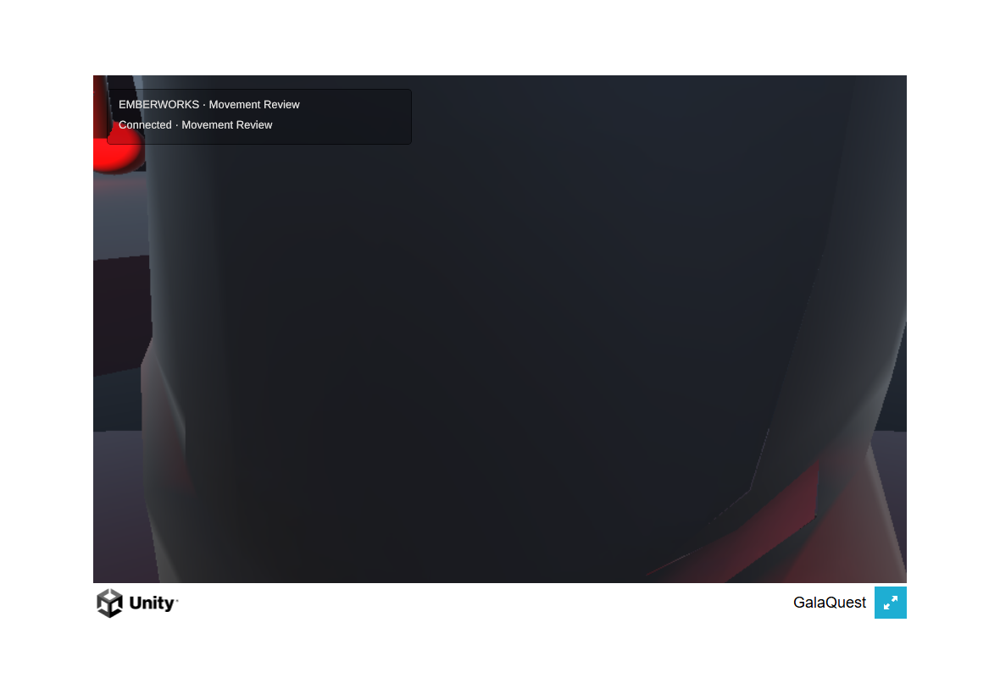

# Mobile camera checkpoint: initial framing failure

**Tested public source:** `90d7e1e6bce44e1cea2e8358befcd7ccd6090e13` (draft PR #143).

**Overall visual result: FAIL.** The connected browser build opens with the camera inside the hero's body. The hero fills the playfield, preventing useful traversal. This checkpoint is not ready for physical-iPad acceptance.

## Evidence and limits

- Unity 6000.3.23f1 WebGL build succeeded. Compressed game files total 15,619,545 bytes. The WASM Brotli file SHA-256 is `77be3aa814034d05b7d1a35b2489cc65de0424f20cfb1265de6d9309b95d41b0`.
- Producer inspected the real connected build in desktop Chrome with simulated touch input, using an isolated profile/save store. Captures cover spawn, orbit, two walking moments, and pinch. No browser exception or browser error-log event was captured during that run; this is not an iPad or performance result.
- After drag orbit, actual network movement used direction `(-0.461779, 0.886995)`. Release sent magnitude zero. The final sampled predicted/authoritative drift was about 0.0081 world units without a snap.
- Focused Node movement/socket and guidance checks passed 15/15. Unity U1 Edit Mode passed 35/35. Unity U1 Play Mode passed 3/3 on identical source immediately before the checkpoint commit. The [push unit run](https://github.com/Galashots/galaquest-public/actions/runs/34143460642) passed on this exact SHA.
- The corrected original-camera comparison failed exactly three drag/pinch cases and passed 24 others. Early test attempts with Edit Mode `SendMessage` and unisolated input were invalid and are superseded by the corrected fixture.

## Causal follow-up

A new regression against the actual Emberworks entry scene reproduces the camera failure: the camera is only **0.769 units from the hero**. Its sphere cast reports `GateThreshold` at distance zero. The wide, thin cylinder uses Unity's default capsule collider, whose radius creates a tall invisible volume instead of matching the rendered floor disc.

The correction must preserve the authored scene and repair that collider geometry. The earlier synthetic obstruction test remains useful but was insufficient: it tested a box wall and did not exercise the real entry scene.

The same source-bound Unity inspection found no Animator below the runtime hero. Its original FBX has changing idle, walk, and run clips. Full-body motion review remains pending until framing is restored; source clip presence alone does not accept locomotion.

Camera/input, locomotion, collision, and physical-device acceptance remain part of the open movement milestone in [the brief](../../briefs/U1_MOBILE_MOVEMENT.md).
