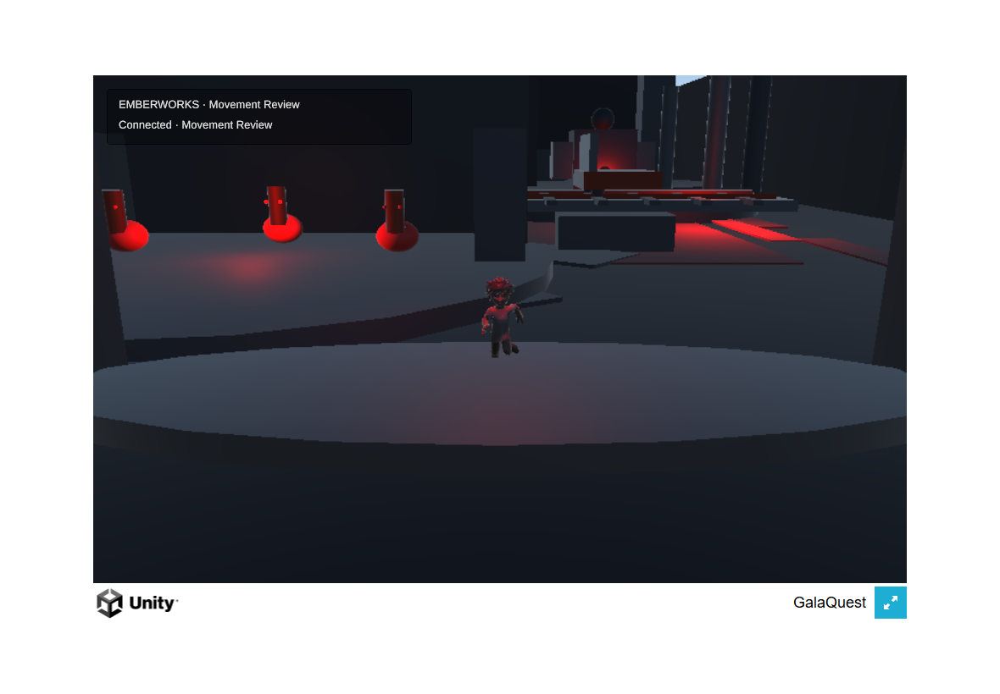
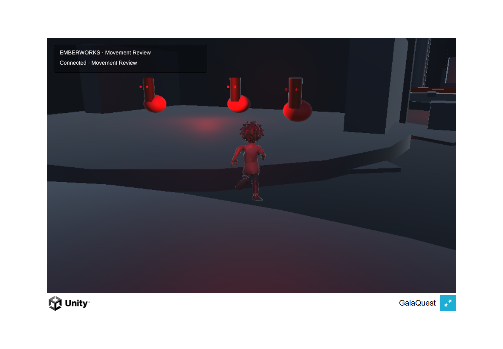

# Mobile camera: corrected entry framing

**Tested public source:** `497cd669340f2b5eee357ac405893e3601918345`.

**Producer result:** the entry-framing defect is corrected in the connected browser build. Touch drag rotates the view, pinch enlarges the hero as expected, and camera-relative movement and release remain operational. This is a bounded camera observation; the movement milestone and physical-iPad acceptance remain open.

## What changed and what was checked

Unity's authoring API replaced 25 cylinder capsule colliders with mesh colliders matching the authored geometry. Comparing the serialized scene before and after confirmed that the other 653 serialized objects are unchanged, allowing for component references/order and empty-field whitespace. Hero anatomy, rig, render geometry, transforms, materials, lights, and script data were preserved.

The actual-scene regression changed from a 0.769-unit camera distance failure to a pass. All 36 U1 Edit Mode tests passed on the repaired source before checkpointing it; focused Node/socket/guidance checks passed 15/15 on the commit. The [hosted push unit run](https://github.com/Galashots/galaquest-public/actions/runs/34145109819) also passed on this source.

The Unity WebGL build succeeded. Its WASM Brotli SHA-256 is `8db01550f5fb4a92813cf6ad68c92b837099be95bc518ef0ace124e26020cd4f`. Producer inspected spawn, orbit, two movement captures, and pinch in desktop Chrome with simulated touch and an isolated profile/save store. No browser exception/error-log event was captured. The final sampled prediction drift was about 0.0060 world units without a snap, and release sent magnitude zero. These are sampled desktop results, not Safari performance or physical-device acceptance.

## Strongest remaining defect

**The hero remains frozen in a mid-run pose while moving and after release.** The complete body is now visible, confirming the reported locomotion defect in the running game. The runtime hero has no Animator, while its unchanged, provenance-matched FBX supplies changing idle, walk, and run clips. Animation wiring is the next correction.

The dark primitive environment, default Unity browser shell, and unfinished route presentation are still prototype quality. They do not meet the approved two-level release finish. Player/world collision alignment and physical-device review also remain open under [the movement milestone](../../briefs/U1_MOBILE_MOVEMENT.md).

The [earlier failed capture and causal evidence](camera-checkpoint-90d7e1e.md) remain available for comparison.
