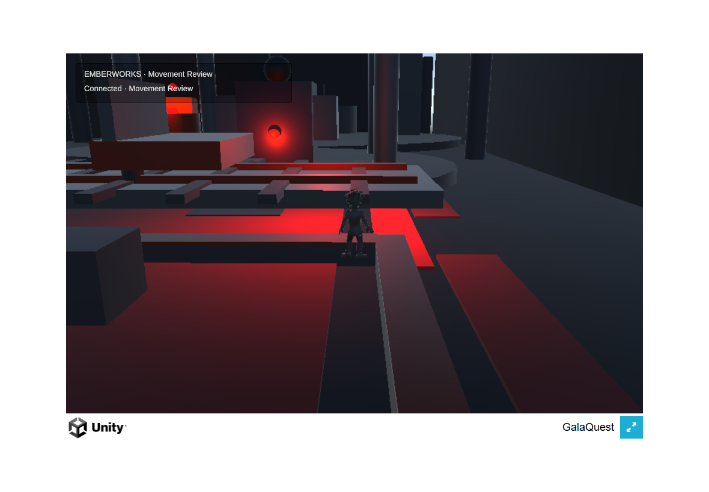
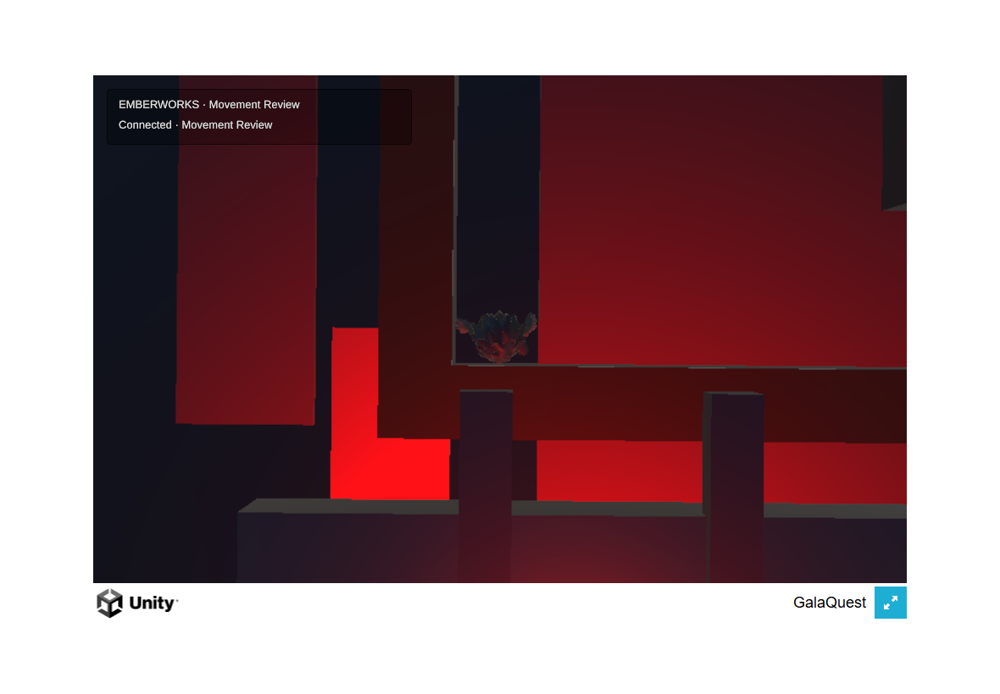
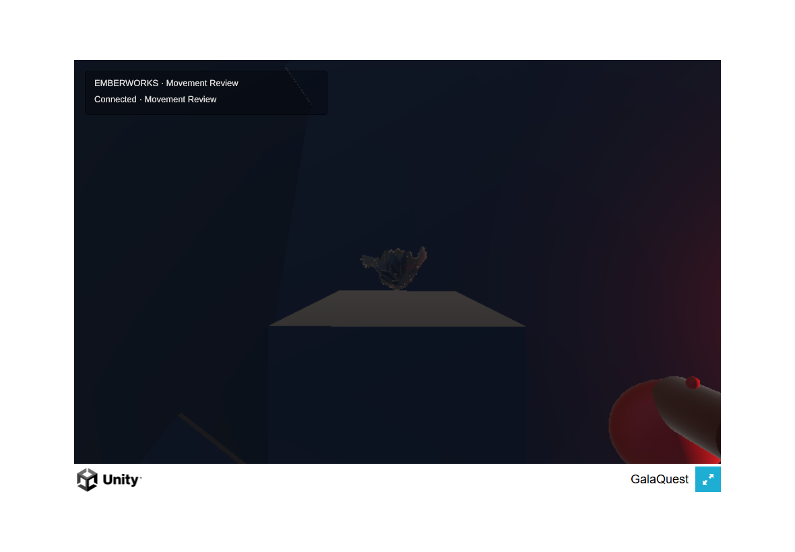

# Opening-route camera verification

**Tested public source:** `2904587ff078f7cb247dc97e3fd62695df05369c`.

The rebuilt Unity browser game retains a visible hero at the previously failing northeast endpoint. The route now stops at z=20 before the raised Express bridge. Orbiting into the cavern wing or north boundary uses the unobstructed overhead fallback instead of pushing the camera inside the hero. This closes the reproduced camera-collapse defect; it does not establish physical iPad comfort or final visual acceptance.

## Evidence

- Unity: **46 U1 EditMode / 4 U1 PlayMode passed**. The EditMode suite includes six actual route positions across four cardinal camera directions and three pitches. The correction follows two red camera reproductions on the preceding implementation.
- Node: **33 focused movement, socket, and guidance checks passed**. Hosted required unit passed on [push](https://github.com/Galashots/galaquest-public/actions/runs/34152019830) and [PR](https://github.com/Galashots/galaquest-public/actions/runs/34152022191).
- WebGL: strict build completed successfully. The four browser build files total **15,888,488 bytes**. WASM Brotli SHA-256: `b64bd5a0a28225918b5095876778f9c1488426b77eb3cba1069e85b256a8c6ba`.
- Actual desktop Chrome walkthrough with emulated touch: wing z=12.15, back z=18.55, west/east x=-10/10, north z=20, south z=3; sampled boundary drift below 0.001 m without a snap. Drag, pinch, walking/running, and release were exercised.
- Two actual Unity browser contexts used isolated synthetic profiles and temporary save storage. The second moved from z=4 to approximately 5.68 while the first remained at (-1.275, 8.386); release stopped input. Reload rejoined at (0,4) with a new connection ID while the first stayed connected. This proves input ownership and reconnect, not remote-avatar presentation.
- **Zero captured browser exception/error-log events.** The harness verified the build manifest against the clean source revision and closed its owned browsers/server after completion.

## Producer visual judgment and remaining gates

The producer inspected the three running-game views above. The strongest remaining weakness is the abrupt, directly overhead composition: the hero remains visible, but its face and action silhouette read less clearly than in the normal view. Dark primitive scenery and weak floor separation compound that limitation. This is a functional obstruction fallback in a prototype environment, not a finished adventure presentation.

Physical iPad/Safari performance, simultaneous movement/camera comfort, Owner appearance judgment, and the entry flow remain open under [M1](../../briefs/U1_MOBILE_MOVEMENT.md). Combat and final environment work belong to subsequent packages in the approved two-level release. No provider credits were spent on M1, and no source character rig or anatomy was changed.
