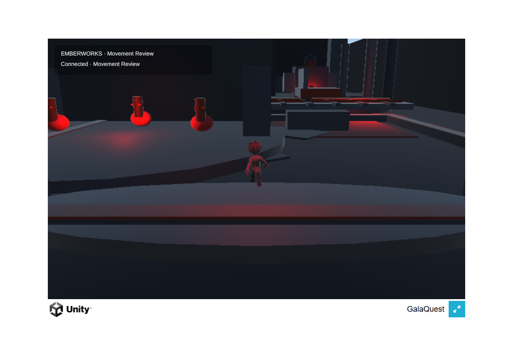
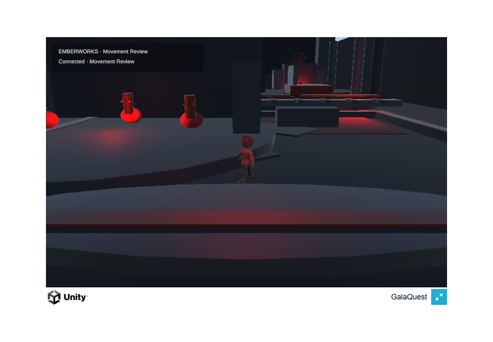
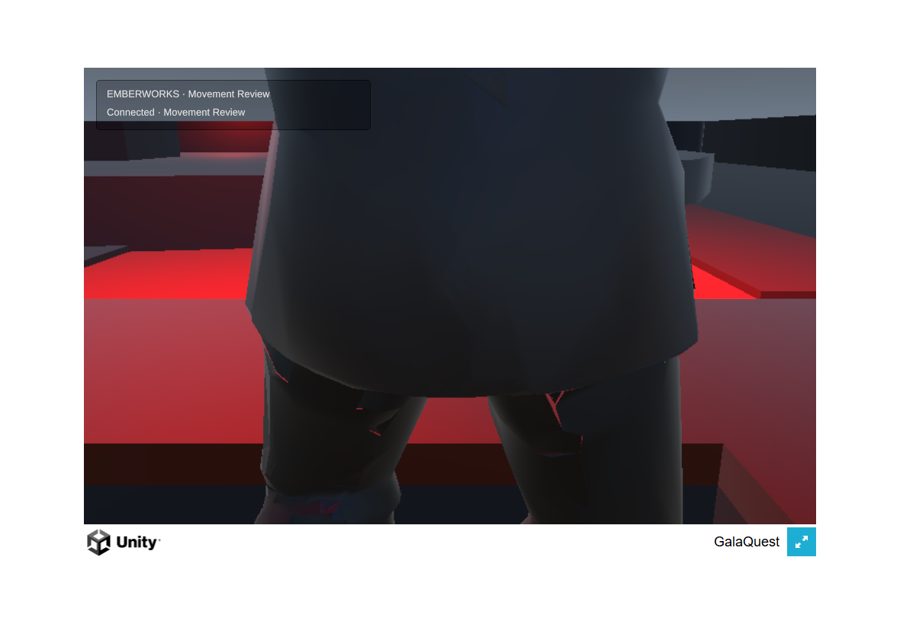

# Animated traversal and wall contact

**Tested public source:** `96b8ee181821b1ac04336844893043f37af2135f`.

**Producer result:** the frozen-pose defect is corrected. Walking and running captures show changing strides, and release returns to idle. The connected hero stops at the tested cavern walls and visible perimeter. The movement milestone remains open: the northeast endpoint exposes a further camera-collapse defect.

## Implementation and checks

The hero uses the existing idle, walk, and run clips through one speed-driven blend tree. Three looping derivatives preserve the FBX curves; the source FBX SHA-256 remains `23c161a6a7045987f54b2dae370d02c665d169aefa0c8b6377ca5ee82c893351`. Root motion is off. Actual predicted travel drives animation, excluding reconciliation from the stride calculation. Anatomy, source importer, hierarchy, and equipment contracts are unchanged.

Node and Unity sweep movement against five matching upright gate/cavern rectangles, with 0.35 m body clearance. Four low stone/copper rails mark the outer envelope. Before correction, both server and Unity advanced through the cavern wing to z=22; the corrected wall stop is z=12.15. A first taller perimeter rail obstructed the spawn camera; the 0.56 m rail top restored that regression without changing movement constants.

- U1 Unity EditMode: **44 passed**, including actual-scene wall/perimeter agreement and 14 shared collision cases.
- U1 Unity PlayMode: **4 passed**, including actual canonical bone motion across several loops, movement-to-Animator speed, and preservation of the hero root.
- Hosted unit: [push](https://github.com/Galashots/galaquest-public/actions/runs/34149247499) and [PR](https://github.com/Galashots/galaquest-public/actions/runs/34149249952) passed.
- Required local Node suite: **2,272 passed, 1 failed, 3 skipped** (2,276 total). The failure is Windows EPERM while `lantern-xp-award.test.mjs` deletes its temporary directory; an isolated rerun repeated the cleanup error. The local suite is not a full PASS.

The WebGL build succeeded. Its WASM Brotli SHA-256 is `0684def87e049299283f05a31b36e79e9a1e7056a32f5a2a02fb52f7647758e5`; the four browser build files total 15,895,118 bytes. The producer inspected walking/running phases, idle, wall contact, perimeter views, and touch movement/camera captures in the actual Unity browser game. These are desktop Chrome observations with emulated touch, not physical Safari acceptance.

The completed browser rerun stopped at wing z=12.15, back wall z=18.55, west/east x=-10/10, and south/north z=3/22. Sampled drift at the wall and north/south boundaries was zero without a snap. Release sent magnitude zero.

Two real Unity clients used separate browser contexts and isolated synthetic profiles/save storage. The second moved from z=4 to approximately 5.688 while the first remained at (-1.215, 8.705); release stopped it, and reload rejoined it at the authored spawn with a new connection ID while the first stayed connected. No browser exception/error-log event was captured in the completed run. This verifies input ownership and reconnect, not remote-avatar appearance. The first two-client attempt had an invalid waiter expecting names in position snapshots; the corrected waiter uses the welcome ID.

## Strongest disconfirming view

At (10,22), the declared flat route extends into the raised Express bridge: its measured collider starts at z=21.5 and y=1.05, and track ties extend to z=20.5. The camera view above fails appearance despite the movement-position checks passing. Subsequent regression tests also reproduce close-wall collapse when orbiting toward the cavern wing. The next correction must keep the active route before the bridge and preserve a readable view beside close walls.

The dark primitive environment, limited floor readability, default Unity browser shell, and incomplete entry flow remain prototype quality. Physical iPad/Safari and Owner visual acceptance are outstanding. This checkpoint is progress under [M1](../../briefs/U1_MOBILE_MOVEMENT.md), not release completion.
