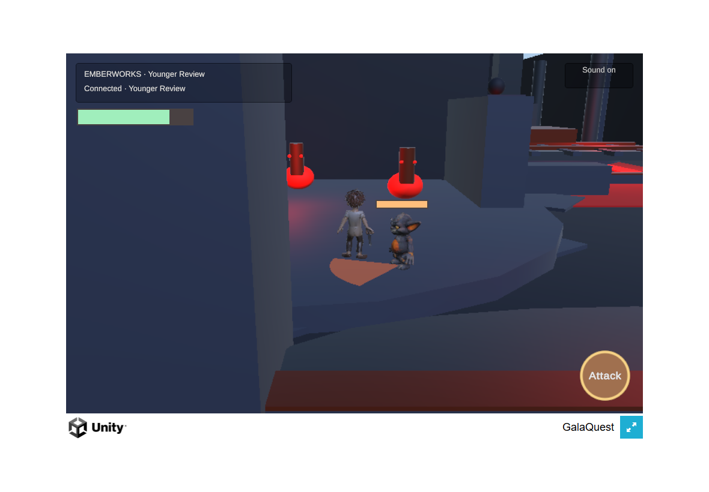
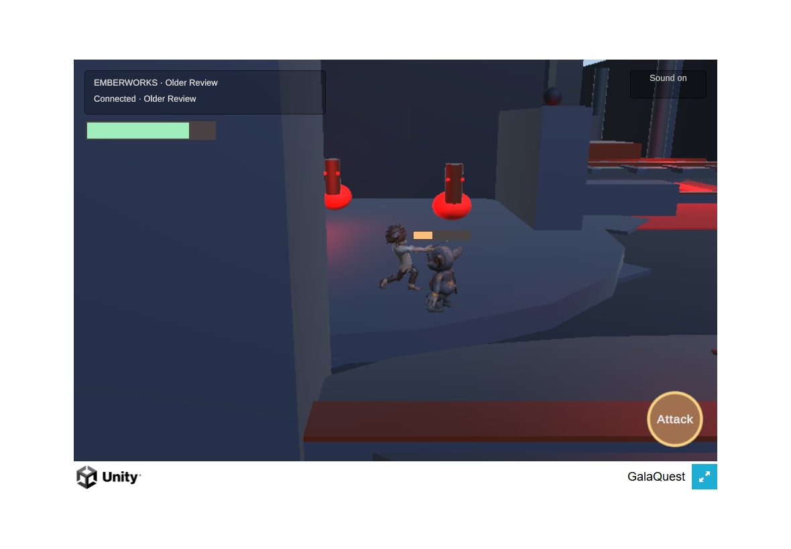
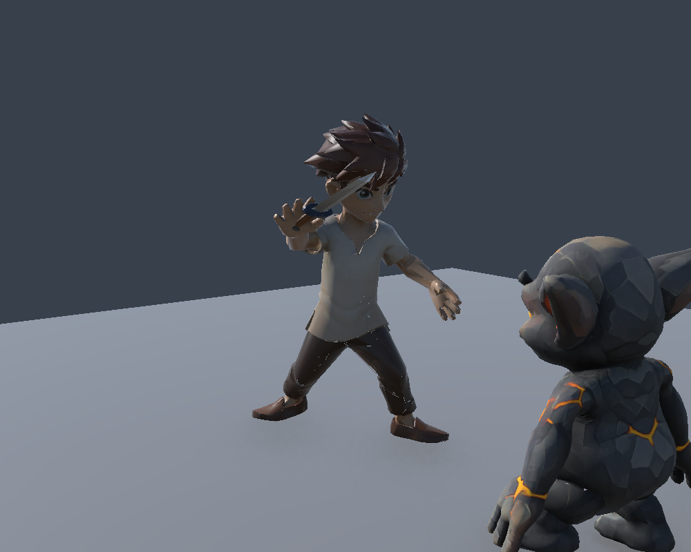
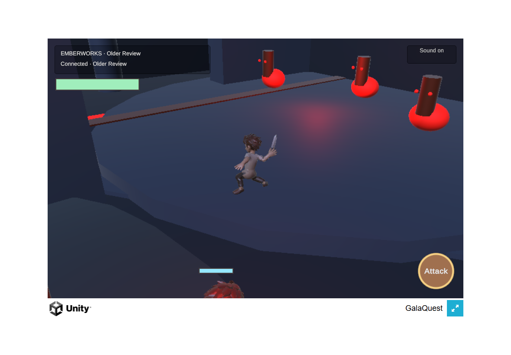

# Connected fight checkpoint

Runtime source: **4c5db35ec1eb1d31f38c21a7495cb58c0405d139**. This checkpoint combines the authoritative Emberworks encounter with the Unity hero, locally rigged gremlin candidate, native combat motion, an existing Ironwood sword, health, attack warning, recovery, and sound controls. It is a local candidate preview; no character or weapon has been promoted to production.

## Behavior and verification

The server owns contact, health, defeat and recovery. Immediate local swing feedback is reconciled with the authoritative animation clock. Two clients see the same enemy identity and keep independent health. Recovering while movement is held requires release before movement resumes.

The browser review exposed a real routing defect: the movement-only destination gate rejected attacks before the combat handler could see them. A two-socket regression failed before the correction and passed afterward. Attack now reaches the encounter handler while the existing restrictions on other destination actions remain.

At the runtime SHA above:

- Seven graphics-enabled Unity PlayMode tests pass, including the actual imported hero and gremlin, native slash motion, independent touch controls, recovery, reconnect, and presentation height on marked walkable surfaces.
- Hosted test runs [34164656694](https://github.com/Galashots/galaquest-public/actions/runs/34164656694) and [34164654151](https://github.com/Galashots/galaquest-public/actions/runs/34164654151) pass. The [director bundle](https://github.com/Galashots/galaquest-public/actions/runs/34164656696) also passes.
- The complete local Node suite reports **2,285 pass / 1 fail / 3 skip**, with exit code 1. The failure is the previously isolated Windows temporary-folder `rmSync` `EPERM` in the lantern-XP test. It has not been relabeled as a passing local suite.

The strict WebGL build passed and the two-client browser fight passed with both client and server at the SHA above. The younger profile landed two strikes (enemy health 30 → 20 → 10); the sibling finished the same enemy (10 → 0). The checks also covered individual health, down/recovery with held movement, mute/unmute through real controls, and reload/rejoin, with zero browser errors. Muted attacks started no audio sources; unmuting resumed a running AudioContext. This verifies routing, not audible sound quality.

The [evidence manifest](fight-checkpoint-evidence.json) records compressed build hashes, candidate hashes, browser observations, test results and image hashes. Four compressed build files total 19,040,219 bytes. Build cleanup restored the source tree before browser verification.

## Producer review

The first browser review found the warning buried in the raised arena floor, lower legs intersecting that floor, dark bodies, and an empty sword hand. The current preview projects presentation height onto explicitly marked walkable geometry, adds preview lighting, and mounts the existing public Ironwood sword through the native right-hand socket. Authoritative planar movement remains unchanged.

The weapon fit is a seeded review candidate. The canonical hero mesh, skeleton, animations and source files are unchanged. Unity sampled slash frames show the blade following native hand motion and boots clear of the floor; those samples do not establish exact impact-frame alignment.

At the current SHA, actual browser stills show the warning above the raised floor, feet clear of the floor, and improved visibility of the gremlin belly and ear. The blade is present but has weak separation at the sampled attack angle; the tight camera also lets the left cavern wall obscure a substantial part of the view. These remain readability concerns. The surrounding cavern is greybox scenery, not release visual finish.

A follow-up with the same built client and the documentation-only server head **92fa4ca7649e24fe4ed3075cf91afed6bd7dc603** exercised touch orbit beside the fight wall, then sampled another slash. The orbit exposed the hero and blade sweep without changing camera code. This counters the concern that the wall makes a clear view inaccessible; it does not settle default framing or physical-device comfort. The sample timestamps in the evidence manifest bracket capture rather than proving frame-accurate impact alignment.

The strongest unresolved hero defect in the browser build above is the open right hand around the sword hilt. The Owner subsequently authorized a bounded repair and supplied real grip photographs; the [hand candidate follow-up](hand-grip-candidate.md) records that work and its separate verification. The gremlin's flat hands and tight crouched knees also remain candidate limitations. The comparison convention is a hilt enclosed by the hand, guard outside the fist, and blade separated from the leg, based on the GalaQuest item reference and official Nintendo character sheets for [Link](https://www.smashbros.com/en_US/fighter/03.html), [Toon Link](https://www.smashbros.com/en_US/fighter/43.html), and [Hero](https://www.smashbros.com/en_US/fighter/72.html).

## Remaining acceptance

Physical Safari touch behavior, audible sound quality, continuous motion/readability, and Owner judgment of the fight remain open. Passing browser automation does not establish that the fight is satisfying. The preview manifest explicitly records `LOCAL_CANDIDATE_REVIEW` and `productionPromotion: false`.

The approved gremlin generation consumed **15 credits**. Provider rigging failed before creating a task or charging the conditional five credits. The existing [candidate receipt](../../asset-production/LAVA_GREMLIN_CANDIDATE_2026-09-07.json) records source bytes, local derivatives and controlled Drive custody. No further provider work, asset promotion, or merge is authorized by this checkpoint.
