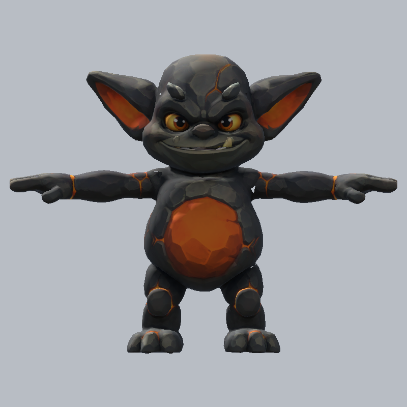
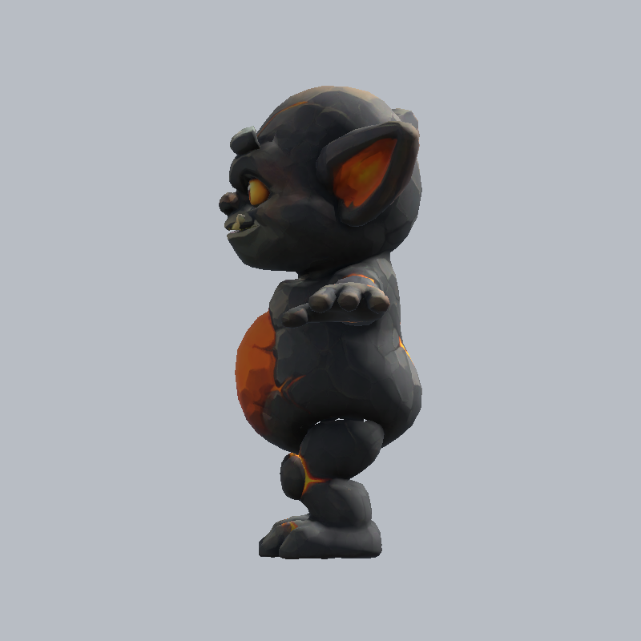

# Lava gremlin body candidate

The Owner approved the generated reference and one Smart Topology T2 body/conditional-rig batch on 2026-09-07. This is **candidate evidence**, not asset promotion.

The body task `01a07d44-22dd-7783-8698-aa17147d3545` consumed **15 credits**, with balance 440 → 425. The rigging POST subsequently returned **422, pose estimation failed**, without a task ID. A fresh balance read remained 425. No replacement generation or further paid task was submitted.

The raw GLB has 10,565 triangles, one mesh, no skin and no animations. FBX and GLB byte custody plus local SHA-256 measurements are recorded in [the receipt](../../asset-production/LAVA_GREMLIN_CANDIDATE_2026-09-07.json). Drive metadata confirmed source IDs, parent folders, names and byte sizes; that is not a downloaded-byte roundtrip verification.

## Unity producer inspection

Diagnostic authoring source: `fb7b42e02317ab73c6637e0055ade3566d39995d`, `U2EnemyCandidateDiagnostics.CaptureBody`. This imports an isolated temporary FBX/texture copy, normalizes its display height to 1.1m, renders neutral views, and removes its temporary assets without saving a scene or modifying the provider source.

Front, rear, side and three-quarter views preserve the approved large ears, facial expression, orange belly, broad feet and squat outline. The strongest mismatches are flattened open hands where the reference had fists, narrow knee connections, and some broad raised stone shapes. The side view still separates arm, belly and legs, so the body was usable enough to try the conditional rig. The provider failure means deformation and native motion remain **UNKNOWN**.

This is the concrete counterexample to treating Smart Topology as automatic animation readiness: compact geometry and a useful silhouette did not establish pose-estimator compatibility. Local pose/orientation and rigging investigation comes next, with no implicit authorization for another paid generation.

The [publisher comparisons](https://play.nintendo.com/activities/opinion-polls/minecraft-dungeons-mob-attack-poll/) were inspected for broad readable masses, face contrast and limb separation. They are convention references, not copied GalaQuest identity. The generated target controls silhouette/proportion/palette and remains non-canonical. Motion in Unity Play Mode, the actual cavern framing, and Owner asset acceptance are still required.
