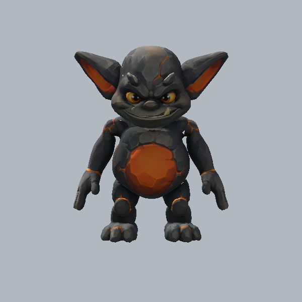
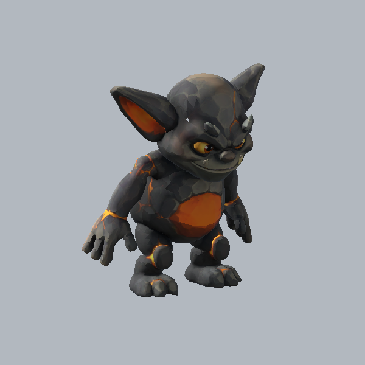
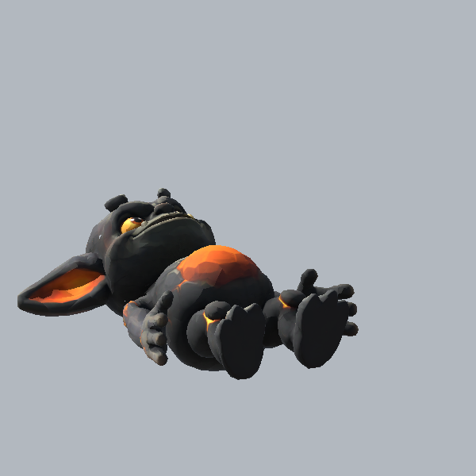

# Lava gremlin: local rig candidate

At **aed840116cfd6dfbfec83ba549fd87dfd238cc6b**, the first local rig passes structural/native checks and the Unity PlayMode diagnostic. This is a candidate for integration; it is not Owner or running-game acceptance.

Meshy's approved 15-credit Smart Topology body was preserved. The provider rejected pose estimation without creating a rig task or charging the conditional five credits. Blender heat weighting also failed; the local recipe therefore explicitly authors joint cross-section weights for this body, limited to four normalized influences. No source sculpt or topology change was used. The new enemy skeleton has 21 deform joints and two non-deforming markers; it does not alter the hero family.

The FBX imports five moving clips: idle 2.00s, scuttle 0.44s, bash 1.06s, hit 0.40s, fall 1.20s. The PlayMode check evaluates the actual skin, verifies no limb length change or world-root drift, and captures diagnostic poses after the GPU skin update. Strict native verification matches the animated GLB against the bind-only GLB. The existing anatomy sweep reports matching face/toe facing and negligible node/bind drift; its human shin/thigh reference flags the gremlin's deliberately short shins, so it is descriptive evidence rather than a humanoid approval gate.

The strongest defect is the flat open hand silhouette, followed by the tight knees when crouched. Face, ears and belly remain legible in these neutral captures. The windup/contact distinction needs continuous motion review at cavern gameplay framing with the telegraph and sound. These sampled poses cannot settle that question. Current visual convention/reference comparisons remain in [the body review](gremlin-body-v1.md).

The diagnostic exposed and corrected two test problems: `??` does not handle Unity's missing-component sentinel, and raw FBX mesh vertices use a different scale from `BakeMesh`. A rotating axis-aligned bounding box also produced a false explosion alarm. The final check compares baked radial reach and actual limb lengths. Earlier capture timing showed the previous GPU pose; yielding before capture corrected it.

The server now gives the gremlin a 0.64s windup, fixed attack direction, a 36-degree half arc and recovery through 1.06s. New tests failed before the change for early contact, a sidestep still being hit, and sanctuary entry still being hit. All 43 focused combat/encounter/guidance tests pass at the SHA above; existing Wolf timing is preserved.

Large derivatives are in the controlled [production-working package](https://drive.google.com/drive/folders/11HPc5-BuLMQFu0071tH3MEy-nREMkOfF). Exact source/derivative hashes, Drive IDs and limitations are in the [candidate receipt](../../asset-production/LAVA_GREMLIN_CANDIDATE_2026-09-07.json). Total provider spend remains **15 credits**.
