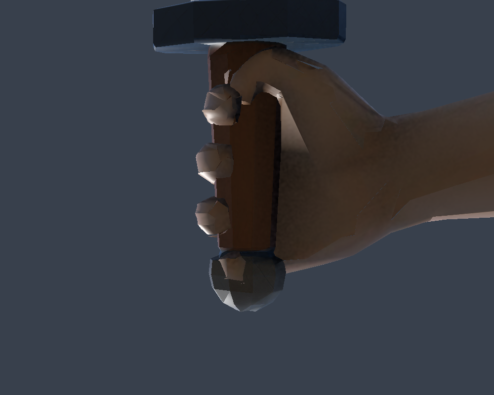
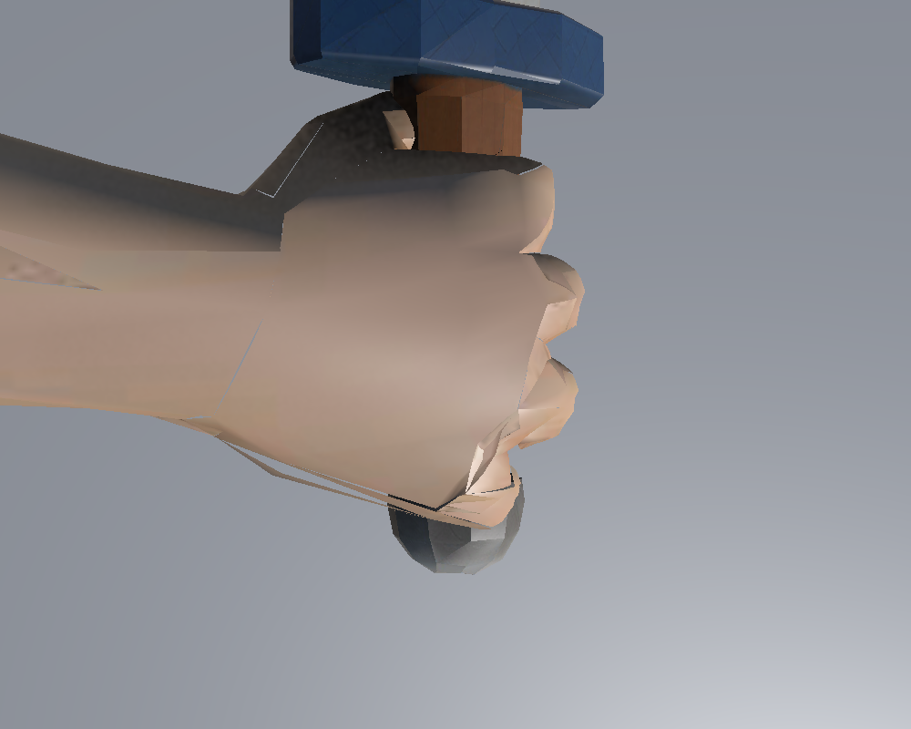
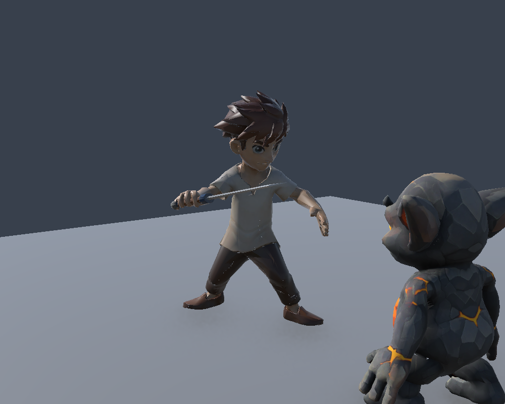
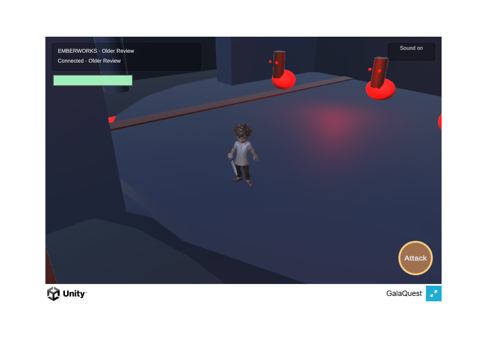

# Right-hand grip review candidate

The Owner authorized a bounded repair of the hero's open right hand and supplied three real grip photographs. The candidate curls the fingers around an authored grip axis, with the thumb outside near the index finger. The canonical Hero FBX, prefab, skeleton and animation clips remain unchanged. No asset is promoted by this work.

The original hand has no finger joints. Simply bending its existing long faces produced inward folds, so the candidate replaces 356 hand triangles with a locally refined surface. The original vertex and attribute buffers remain intact; the replacement interpolates the existing UV coordinates, normals and skin weights. Unity verifies the actual imported position, UV and bone correspondence instead of assuming Blender and Unity share vertex indices. The complete candidate hero has 12,140 triangles and retains the original 24-bone rig.

The existing Ironwood sword is fitted to a marker derived from that hand surface and the original bind pose. Its actual blade axis is independent of the prefab's import rotation. The candidate uses a longer longitudinal fit while preserving the radial scale, so the hilt spans the curled fingers. This remains a seeded review fit.

## Reproduction

The [candidate receipt](../../asset-production/HERO_RIGHT_GRIP_CANDIDATE_2026-09-07.json) pins the source and candidate bytes and links the derivative's controlled Drive working custody. The candidate inherits the existing character's [licence basis](../../../ASSET-LICENSES.md); it is not CC0. The personal reference photographs are not published.

Run the checked-in recipe with Blender 5.2 in background mode:

```text
blender --background --factory-startup --python tools/assets/author-hero-grip-candidate.py
```

An optional `-- --render` appends neutral diagnostic stills. Outputs go to the ignored `.local/m2/hero-grip-candidate` directory. The recipe checks the source FBX hash and never saves over it. Reproduction of the qualified bytes is checked separately from visual acceptance.

Set `GQ_U2_GRIP_REVIEW=1` when running `U2CombatPreview` to stage the candidate. Otherwise, the preview continues using the canonical hero. The existing local gremlin candidate is also required by the combined fight preview; its [receipt](../../asset-production/LAVA_GREMLIN_CANDIDATE_2026-09-07.json) identifies those inputs.

For graphics-enabled Unity PlayMode review, also set `GQ_U2_REVIEW=1` and `GQ_U2_CAPTURE=1`, then run `U2CombatPresentationPlayModeTests`. The test exercises the native slash, damage, down/recovery and rejoin, and captures both whole-character and hand views. Images are sampled poses, not frame-accurate impact evidence. Close-up cameras use an appropriate near plane; the first exploratory camera clipped through the hand and was corrected.

`U2CombatPreview.BuildWebGL` requires committed source, stages only temporary review assets, records the hand candidate hash in the build manifest, and cleans up its temporary assets. It does not replace the canonical scene or hero.

## Verified checkpoint and Owner review

The connected preview source is **b8b9735e3777570f4d887e0e0ad07d3eaeba66f5**. A new test against the actual scene failed before the local-hero correction: the scene retained `char1` while the remote spawn prefab used `HeroRightGrip`. The correction changes only the temporary scene's local mesh and bounds, retaining its hero transform and movement/camera bindings. The passing test reopens the saved preview and also verifies that the canonical scene bytes remain unchanged.

The strict WebGL build and real two-browser run pass at that SHA, with both client and server matching it. The first player reduced the enemy from 30 to 20 to 10 health; the sibling finished it. The run also verified stopped held input after recovery, mute/unmute, rejoin and touch orbit, with zero browser errors. Four compressed build files total 19,229,420 bytes. Hosted [test run 34172494273](https://github.com/Galashots/galaquest-public/actions/runs/34172494273), [test run 34172492121](https://github.com/Galashots/galaquest-public/actions/runs/34172492121), and [director bundle 34172494265](https://github.com/Galashots/galaquest-public/actions/runs/34172494265) pass.

The native Unity combat test and diagnostic images below were produced at **a5ecf5fc8e62e485e4776493b933c4b83bbbd117**. The candidate bytes, native clips and fit are unchanged in the later connected-scene correction. The [evidence manifest](hand-grip-evidence.json) keeps these source identities separate and records the test, build and image hashes.










The large inward folds from the first drafts are resolved in the inspected Unity views. The strongest remaining hand concerns are the little-finger base crease, narrow bevel faces and contact with the pommel in close-up. Eight narrow/base triangles oppose the differential-facing estimate; this is not a clean geometry pass. The preview uses a fixed grip pose with the existing hand bone. Finger animation is not added.

The browser frames show the sword following the hand and a readable sweep after orbit. The default cavern wall still blocks part of the view, and the environment remains greybox. Physical Safari comfort, audible sound quality, continuous-motion judgment and Owner visual acceptance remain open. The [Owner packet in controlled Drive custody](https://drive.google.com/drive/folders/1m51k_mc8ThoyN6KMKaERGj4NMDgiATVn) includes the defect-exposing angles. It requests a decision on this grip candidate; production promotion remains false.

The [earlier connected fight checkpoint](fight-checkpoint.md) records the broader combat implementation and its previous source SHA.
