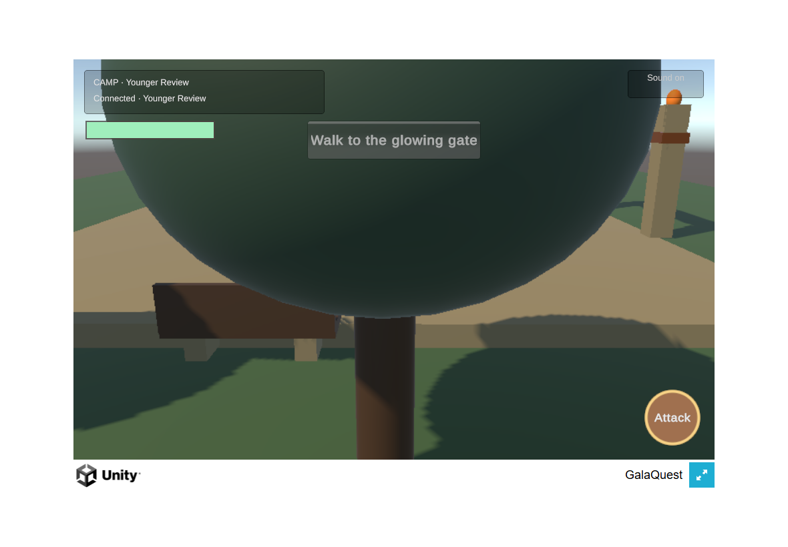
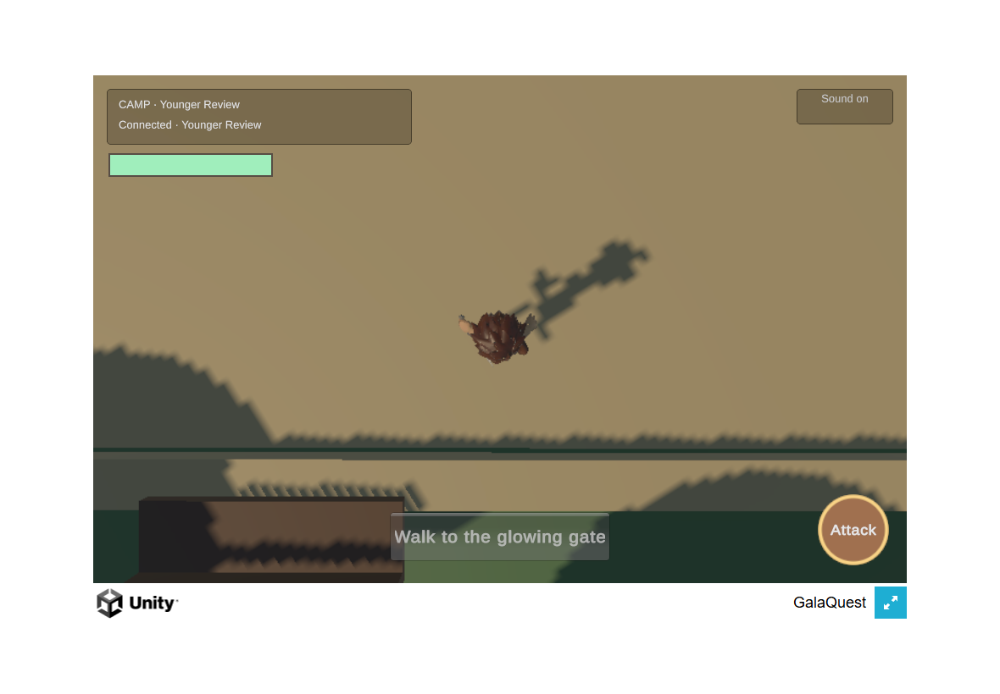
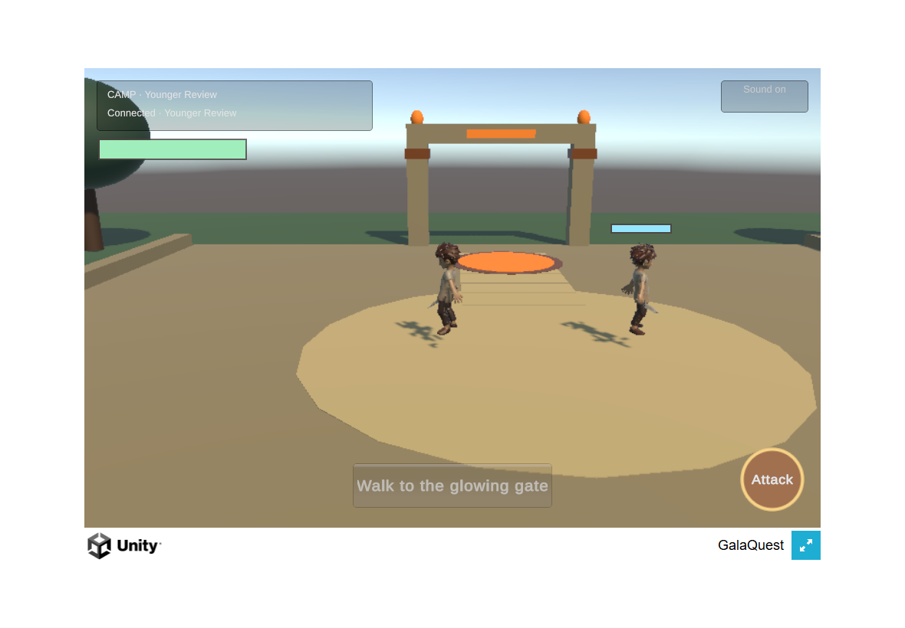

# M3: independent travel

## Package frame

This is an L package: a small Unity hub and two-way travel to Emberworks, with two children free to
separate and reunite in one ongoing world per destination. It follows the verified first-fight
checkpoint `be9d88f95d98b40440029ba1dcc2ebe8b9fc2840` on a separate branch.

Checkpoint 1 implements server destination ownership and the additive protocol handoff. Checkpoint 2
wires the Unity scene, controls and presentation, then tests real two-browser travel and reunion.
Physical Safari iPad acceptance remains an Owner gate. Personal math/rewards and worm admission are
sequential follow-up packages within the approved miniature-loop milestone. No new provider spend,
asset promotion or PR merge is implied by this networking package.

## Owner decisions on 2026-09-07

The Owner approved the reviewed hand grip for playtest integration, accepting the documented small
crease and pommel-contact limitations for later polish. The approved candidate is identified by the
[hand receipt](../../asset-production/HERO_RIGHT_GRIP_CANDIDATE_2026-09-07.json). Its integration remains
in the first-fight asset package, separate from this server change.

The Owner also set a new stopping point: finish the hub and Emberworks work and associated pushes,
then pause for a progress discussion before starting the second level, Sunroot Glade. The agreed
two-level release remains the eventual objective; second-level implementation must wait for that discussion.

## Server checkpoint behavior

The transport owns globally unique connection/player IDs and one shared reward coordinator/store.
Each recognized destination owns its own simulation and receives only its own players and world
events. Existing clients with no destination still join Village; it remains the legacy geography,
not the new Unity hub. Unknown destinations continue to fail explicitly.

`travel` carries `destinationId` and a required non-negative integer `worldEpoch`. The server replies
with `destination-changed`, including the full arrival snapshot, personal facts, stable player ID and
the next epoch. Subsequent controls must carry that epoch. A transition preserves HP and cooldowns,
cancels active attacks, and starts with released input at the destination spawn. Old-world messages
are ignored. Legacy clients remain at epoch zero without a wire-shape change.

Travel does not recreate a sibling's simulation. Participation ledgers are scoped by destination,
so equal authored enemy IDs cannot share credit. On reconnect, outstanding participation and corpse
claims move to the new connection ID; an awarded personal fact follows an active contributor to
their current destination without forwarding the other destination's combat state. Saved reward
facts remain in the existing store and reconnect through the existing profile journal.

## Evidence and remaining work

The first real-socket test failed on the package base because the second destination was rejected.
The travel test failed before the new message was implemented. A separate counterexample omitting
the reconnect participation handoff loses the returning child's XP after a real shared fight.
These tests now exercise separate destinations, reunion with a damaged enemy, stale controls,
HP/cooldown continuity, personal coin restore, scoped XP and protocol validation.

At **d7285e577dcf9e1ae1e8ccaa48a0cfd3ff0f7fdd**, the seven focused server/guard checks pass and
the full [hosted unit gate](https://github.com/Galashots/galaquest-public/actions/runs/34174864788) passes.
The earlier full local run at runtime-equivalent `7b71feec320497a59c40f44b465bbb5bb507b3f8`
reported 2290 pass, two fail, three skip: a source-text Beacon scanner needed to follow the new
destination loop (fixed in d7285e5), and the previously observed Windows Lantern-XP temporary-folder
cleanup hit `EPERM`. The latter occurred during cleanup, not a failed reward assertion.

The server checkpoint does not establish Unity, browser or physical iPad acceptance.

## Unity camp and travel checkpoint

The existing Unity player scene now contains a small camp alongside the Emberworks scenery. One
session, hero and camera survive travel; the acknowledged destination selects the scenery, resets
position prediction and clears the previous destination's combat views. The camp is the initial
destination. Its gate offers entry to Emberworks, and a Return to camp control allows each child to
leave independently. Touches on the travel control are excluded from camera gestures.

Travel releases movement before the request, blocks controls while arrival is pending, and requires
neutral movement before the next stride. New controls carry the acknowledged epoch. Wrong-player
arrivals and old-world snapshots are ignored. A broken socket reconnects to the last acknowledged
destination with the same selected profile. A page reload starts at camp.

The initial Unity regression failed because the session had no travel operation. The completed
EditMode run covers arrival, retry after failed send, synchronous acknowledgement, stale snapshots,
reconnection, existing collision/locomotion behavior, and the admitted hand asset. The old locomotion
fixture used duplicate welcomes to reposition a hero; it now opens a fresh fake connection before
each welcome. No movement constants were tuned for that fixture.

### Camp visual convention

GalaQuest's current hero and materials remain the project reference. Three inspected comparison
images informed only spatial conventions: an open meeting area with destinations at the edges in
[Kirby's Waddle Dee Town](https://www.nintendo-master.com/news/kirby-et-le-monde-oublie-se-devoile-en-images-et-en-artworks),
a compact action courtyard with low foreground scenery in
[Minecraft Dungeons' camp](https://www.windowscentral.com/minecraft-dungeons-guide-how-replay-levels-higher-difficulties),
and paths, benches and lighting that frame a gathering place in this
[LEGO Fortnite village](https://www.eurogamer.de/lego-fortnite-ist-viel-mehr-lego-als-fortnite-aber-deshalb-nicht-weniger-spannend).
These are attributed game screenshots carried by secondary publications; their art is not copied
into the project. The camp geometry and simple materials are authored locally through Unity.

Exact-source WebGL build, two-browser travel/reunion, running-game visual review and physical iPad
results must still be recorded below. This checkpoint does not claim the miniature loop or either
full adventure complete. The existing gremlin remains a separate review candidate; travel work
does not promote it or authorize further provider spend.

### Browser checkpoint and causal repairs

At **2346bf4513557d6bc305dbe82cf40f20b6ca5541**, the strict, non-development WebGL candidate build
passed and the [hosted unit gate](https://github.com/Galashots/galaquest-public/actions/runs/34178387057)
passed. Two real Unity browser clients verified enemy-free camp, independent travel, released-input
arrival, separation, damage retained when a sibling arrives later, reunion, socket reconnection to
the acknowledged destination, and return to camp while the sibling remains in Emberworks. The
local browser report recorded no browser errors. This proves desktop-browser behavior, not iPad
performance or touch acceptance.

Visual self-review found two defects: the top travel button covered the gate, and a camp tree could
completely hide the hero when orbiting at the eastern boundary. The latter was reproduced by a
scene-based EditMode test: the uncorrected camera stayed 9.836 units away where the obstruction
required less than 7. The repair gives upright scenery outside the walk envelope camera colliders;
flat ground discs remain collider-free. The travel button moves below the play space, and its touch
region is excluded from both camera and joystick ownership. After repair the full EditMode run
reported 187 pass, zero fail, one optional custody-review skip. Rebuilt visual verification is pending.

The candidate build helper now supports opt-in `GQ_FAST_REVIEW_BUILD=1` for visual iteration using
Unity's [BuildTimes WebGL optimization](https://docs.unity3d.com/6000.3/Documentation/ScriptReference/WebGL.WasmCodeOptimization.html)
and disabled compression. It retains StrictMode, non-development output, clean-source and candidate
hash guards, and restores prior settings afterward. The manifest explicitly identifies optimization,
compression and fast-iteration status. Default builds retain their existing settings. A fast review
build does not establish final optimized-build performance on physical iPads.

### Repaired browser and visual result

At **931919b0a5ed9bf5c6d193b31d1122caf7cf585f**, the strict, non-development fast review build passed
and restored a clean checkout. Its [manifest](build-931919b-fast.json) records exact output hashes and
the BuildTimes/uncompressed flavor. The [hosted unit gate](https://github.com/Galashots/galaquest-public/actions/runs/34181520797)
also passed. The same two-browser flow passed all ten checks again with zero browser errors: camp,
held-input arrival, separation, a wounded encounter, return, sibling arrival, reunion, reconnection,
independent final camp return, and the edge orbit. Both client and server were this exact SHA.

The producer inspected the running-game captures at normal gameplay framing and compared the same
boundary orbit before/after. The obstruction correction keeps the hero visible; the travel button
no longer covers the gate. The strongest remaining limitation is the steep overhead fallback at
that crowded boundary. Camp scenery is visibly a greybox and the gremlin remains a separate candidate.
These are functional travel proofs, not finished-art or physical-iPad acceptance.

| Before: hero hidden (`2346bf4`) | After: hero visible (`931919b`) |
| --- | --- |
|  |  |

The reusable browser driver is `tools/unity-playtest/travel.mjs`. Run it from the repository
root with a matching candidate-build manifest as its first argument and an optional output suffix
as its second. `GQ_CHROME_PATH` can override the Windows Chrome executable. It owns isolated browser
profiles and a temporary server, checks build-file hashes and source identity, and closes its own
processes. Its output report records client and server SHAs separately. When deliberately validating
an unchanged older client against a later server, `GQ_REVIEW_SERVER_SHA` must explicitly name the
current server head; that does not retroactively change the client evidence.

The independent-travel implementation checkpoint is complete for desktop browser review. Owner
iPad acceptance and the broader miniature co-op loop remain open; subsequent packages supply personal
progression presentation, learning and admitted companions before completing Emberworks.

The evidence-only head `8926a4058f39a84f84430fb48b987ee5dd6b35c7` exposed a harness integration error
in hosted CI: placing the new driver in the legacy runtime-test directory enrolled it in a suite
whose runners target the Three.js client and take no Unity build manifest. The driver now lives in
the separate Unity playtest tools directory, still uses the shared owned-server helper, and explicitly
clears its isolated browser origin before seeding fixture profiles. No legacy gate was weakened.
